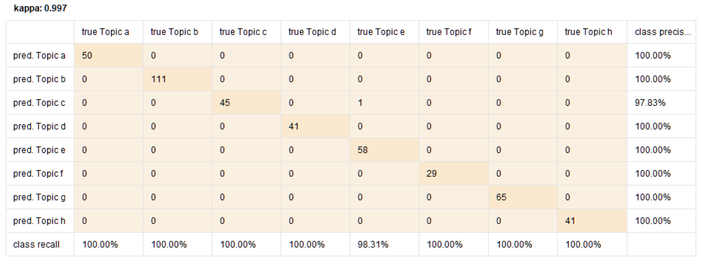

```{r setup, include=FALSE}
library(flexdashboard)
```

About
========================================
This storyboard presents the results of all the 12 case studies performed in the book, "Text Mining: An Uncharted Territory for Librarians". The numbers 1A, 1B, 4B and so on, indicate the case study for that particular chapter and the letter represents the analysis from different tools, for instance, 1A shows the results from Chapter 1 for clustering using Orange tool and 1B shows the results from Chapter 1 for clustering using R. To know more about the case studies, and the methodology used to get the results, kindly read the book available on Springer. 


For this storyboard: ©2021 Lamba and Madhusdhan - all rights reserved, unless stated otherwise.


1A {.storyboard}
========================================

### Heatmap showing distances between documents


***
The heatmap plot shows the distances between the documents.

### Clustered Heatmap showing distances between documents


***
The clustered heatmap plot shows another way to visualize the distances between the documents.

### Dendogram showing hierarchical clustering of documents


***
The dendogram presents the hierarichal clustering of documents using the ward method.


1B {.storyboard}
========================================

### Determine the number of K for clustering using Elbow Method

```{r}
#Load libraries
library(readr)
library(proxy)
library(RTextTools)
library(fpc)
library(wordcloud)
library(cluster)
library(tm)
library(stringi)
library(textmineR)
library(factoextra)
library(ggplot2)

#Load dataset from the github
data <- read.csv("clustering_sample_data.csv")

#Create Document Term Matrix
dtm <- CreateDtm(doc_vec = data$Abstract,
                 doc_names = data$S.No.,
                 ngram_window = c(1,2),
                 stopword_vec = c(stopwords::stopwords("en"),
                                  stopwords::stopwords(source = 'smart')),
                 lower = TRUE, 
                 remove_punctuation = TRUE,
                 remove_numbers = TRUE,
                 verbose = FALSE,
                 cpus = 2)

#Construct matrix of term counts to get IDF vector
tf_mat <- TermDocFreq(dtm)

#TF-IDF
tfidf <- t(dtm[ , tf_mat$term ]) * tf_mat$idf
tfidf <- t(tfidf)

#Convert TF-IDF matrix to standard R matrix
m <- as.matrix(tfidf)

#Determine the number of K for clustering
fviz_nbclust(m, kmeans, method = "wss") + geom_vline(xintercept = 5, linetype = 2) + labs(subtitle = "Elbow Method")
```

***
For clustering in R, elbow method was used to determine the number of clusters.


### Visualizing distance matrices 

```{r}
#Compute Distance Matrix
require(stats)
res.dist <- dist(x=m, method = "euclidean")

#Visualizing distance matrices
fviz_dist(res.dist)
```

***
Euclidean distance method was used to determine the distance between the documents. 


### Agglomerative hierarchical clustering

```{r}
# Agglomerative hierarchical clustering
require(stats)
res.hc <- hclust(d = res.dist, 
                 method = "ward.D")

#Coloring Dendogram
require(factorextra)
require(ggsci)
fviz_dend(x=res.hc, cex = 0.8, lwd = 0.8, k=5, rect = TRUE, k_colors = "jco", rect_border = "jco", rect_fill = TRUE, ggtheme = theme_void())

```

***
Hierarchical clustering with dendrograms is another way to visualise the distance between the documents. 

### Circular Dendogram

```{r}
#Different types of dendogram
fviz_dend(res.hc, cex = 0.8, lwd = 0.8, k= 4,
          rect = TRUE,
          k_colors = "jco",
          rect_border = "jco",
          rect_fill = TRUE,
          type = "circular",
          repel = TRUE)
```

***
Circular dendogram is yet another way to visualise the distance between the documents. 


### Phylogenic Dendogram

```{r}
fviz_dend(res.hc, cex = 0.8, lwd = 0.8, k= 4,
          rect = TRUE,
          k_colors = "jco",
          rect_border = "jco",
          rect_fill = TRUE,
          type = "phylogenic",
          repel = TRUE)
```

***
Phylogenic structure is another way of visualizing the same results with different perspective according to your research problem and dataset.


4A {.storyboard}
==============================================================

### Topic Modeling using Topic-Modeling-Toolkit (TMT)


***
50 core topics were identified that fitted the corpus of 928 DJLIT research articles wherein only 29 topics were identified as unique. 

4B {.storyboard}
==============================================================

### Topic Modeling using RapidMiner


***
The results shows the topics assigned to the corpus of ETDs. 


4C {.storyboard}
==============================================================

### Method 1: Plotting top words using stm package


***
The figure shows the results for 5 topics using Structural Topic Modeling (STM).

### Method 2: Plotting MAP histogram using stm package


***
The figure shows second way of representing the results from Method 1. 

### Method 3: Visualizing topic model using ggplot2


***
The figure shows third way of representing the results from Method 1 and 2.

### Method 4: Interactive Visualization


***
The figure shows fourth way of representing the results from Method 1, 2, and 3.

### Understanding topics through top 5 representative documents


***
The Table presents the result for top five representative ETDs for the modeled topics and are ranked according to their probability.


### Topic correlation


***
The figure shows correlation between the topics using a network graph.

5A {.storyboard}
==============================================================

### Network Text Analysis of Documents using Bibliometrix in R


***
The figure presents the word co-occurrence network for top 50 words that represent the literature indexed in Web of Science (WoS) database on malaria disease for year 2019. 

5B {.storyboard}
==============================================================

### Network Text Analysis of Documents using Textnets in R


***
The figure represents the 22 clusters/communities of 238 words (nodes) which were determined from the network text analysis of the data.

6A {.storyboard}
==============================================================

### Burst Detection of Documents using Sci2


9 {.storyboard}
==============================================================

### Predictive Modeling of Documents using RapidMiner



***
The screenshot shows the evaluation results for library science ETDs in the PQDT Global database.  
    
