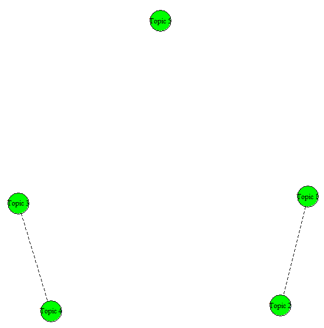
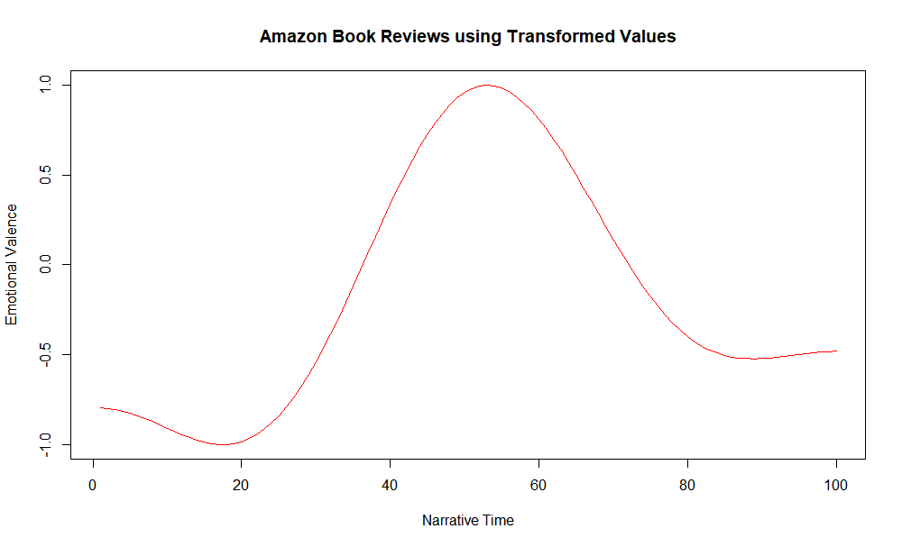

```{r setup, include=FALSE}
library(flexdashboard)
```

# About {.storyboard}

### Introduction

#### This storyboard presents the ***results*** of 13 **case studies** performed in the book, **"Text Mining: An Uncharted Territory for Librarians"**. To know more about the case studies, and the methodology used to get the results, kindly read the book available on Springer. For this storyboard: *©2021 Lamba and Madhusdhan - all rights reserved, unless stated otherwise*. 

#### *`Click on the hyperlink in the figure legend to open the article/book associated with the citation.`*

#### **Important Websites Links**:

-   Buy the Book from Springer Website

-   Book Website

-   Github Repositories of the Chapters Containing the Data, Code and Notebook for the Case Studies

-   Table of Contents

-   Appendixes

### Virtual RStudio Server

```{r}
library(gt)
library(tidyverse)

df <- tibble(
           Case_Study = c("1B", "4C", "5B", "6B", "7B", "9A"),
           Title = c("Clustering of Documents using R", "Topic Modeling of Documents using R", "Network Text Analysis of Documents using Textnets package of R", "Burst Detection of Documents using R", "Sentiment Analysis of Documents using R", "To Make a Dashboard using R"),
           Virtual_RStudio_Server = c(
            "http://mybinder.org/v2/gh/textmining-utl/chapter1/master?urlpath=rstudio", "http://mybinder.org/v2/gh/textmining-utl/chapter4/master?urlpath=rstudio",
 "http://mybinder.org/v2/gh/textmining-utl/chapter5/master?urlpath=rstudio",
 "http://mybinder.org/v2/gh/textmining-utl/chapter6/master?urlpath=rstudio",
 "http://mybinder.org/v2/gh/textmining-utl/chapter7/master?urlpath=rstudio", "http://mybinder.org/v2/gh/textmining-utl/dashboard/master?urlpath=rstudio"),
)

df %>%
     mutate(
         Virtual_RStudio_Server = map(Virtual_RStudio_Server, ~ htmltools::a(href = .x, "link")),
         Virtual_RStudio_Server = map(Virtual_RStudio_Server, ~ gt::html(as.character(.x)))) %>%

gt()  
```

------------------------------------------------------------------------

**Reproduce the analysis in the cloud** without having to install any software. The computational environment used by the authors runs using [BinderHub](https://mybinder.org/). Click the hyperlink to open an interactive virtual [RStudio](https://rstudio.com/) environment for a hands-on practice for the case studies that used R programming language. In the virtual environment, open the `.R` file to run the code. 

### Virtual Jupyter Notebook

```{r}

library(gt)
library(tidyverse)

df <- tibble(
           Case_Study = c("1B", "4C", "5B", "6B", "7B", "9A"),
           Title = c("Clustering of Documents using R", "Topic Modeling of Documents using R", "Network Text Analysis of Documents using Textnets package of R", "Burst Detection of Documents using R", "Sentiment Analysis of Documents using R", "To Make a Dashboard using R" ),
           Virtual_Jupyter_Notebook = c(
            "http://mybinder.org/v2/gh/textmining-utl/chapter1/master?filepath=Case_Study_1B.ipynb", "http://mybinder.org/v2/gh/textmining-utl/chapter4/master?filepath=Case_Study_4C.ipynb",
 "http://mybinder.org/v2/gh/textmining-utl/chapter5/master?filepath=Case_Study_5B.ipynb",
 "http://mybinder.org/v2/gh/textmining-utl/chapter6/master?filepath=Case_Study_6B.ipynb",
 "http://mybinder.org/v2/gh/textmining-utl/chapter7/master?filepath=Case_Study_7B.ipynb", "http://mybinder.org/v2/gh/textmining-utl/dashboard/main?filepath=flexdashboard_R.Rmd")
)

df %>%
     mutate(
         Virtual_Jupyter_Notebook = map(Virtual_Jupyter_Notebook, ~ htmltools::a(href = .x, "link")),
         Virtual_Jupyter_Notebook = map(Virtual_Jupyter_Notebook, ~ gt::html(as.character(.x)))) %>%

gt() 
```

------------------------------------------------------------------------

**Reproduce the analysis in the cloud** without having to install any software. The computational environment used by the authors runs using [BinderHub](https://mybinder.org/). Click the hyperlink to open an interactive virtual [Jupyter Notebook](https://jupyter.org/) for a hands-on practice for the case studies that used R programming language.

# 1A {.storyboard}

### Heatmap Showing Distances Between Documents


------------------------------------------------------------------------

The heatmap plot shows the distances between the documents.

### Clustered Heatmap Showing Distances Between Documents


------------------------------------------------------------------------

The clustered heatmap plot shows another way to visualize the distances between the documents.

### Dendogram Showing Hierarchical Clustering of Documents


------------------------------------------------------------------------

The dendogram presents the hierarichal clustering of documents using the ward method.

# 1B {.storyboard}

### Determine the Number of K for Clustering using Elbow Method


------------------------------------------------------------------------

For clustering in R, elbow method was used to determine the number of clusters.

### Visualizing Distance Matrices


------------------------------------------------------------------------

Euclidean distance method was used to determine the distance between the documents.

### Agglomerative Hierarchical Clustering


------------------------------------------------------------------------

Hierarchical clustering with dendrograms is another way to visualise the distance between the documents.

### Circular Dendogram


------------------------------------------------------------------------

Circular dendogram is yet another way to visualise the distance between the documents.

### Phylogenic Dendogram


------------------------------------------------------------------------

Phylogenic structure is another way of visualizing the same results with different perspective according to your research problem and dataset.

# 4A {.storyboard}

### Core Topics

)](case_study_4a_4.png)

------------------------------------------------------------------------

The results shows the topics assigned to the corpus of research articles.

# 4B {.storyboard}

### Core Topics

 )](4a_5.png)

------------------------------------------------------------------------

The table shows the topics assigned to the corpus of ETDs.

# 4C {.storyboard}

### Method 1: Plotting Top Words using *stm* 


------------------------------------------------------------------------

The figure shows the topics which were identified using *Structural Topic Modeling (STM).*

### Method 2: Plotting MAP Histogram using *stm* 


------------------------------------------------------------------------

The figure shows another way of representing the topic modeling results.

### Method 3: Visualizing Topic Model using *ggplot2*


------------------------------------------------------------------------

The figure shows another way of representing the topic modeling results.

### Method 4: Interactive Visualization

[](https://textmining-utl.github.io/chapter4/)

------------------------------------------------------------------------

The figure shows an interactive way of representing the topic modeling results.

**When you click on the figure, a new window will open in your browser where you can interact and visualizes the changes by altering various parameters.**

### Understanding Topics through Top 5 Representative Documents


------------------------------------------------------------------------

The table presents the result for top five representative ETDs for the modeled topics and were ranked according to their probability.

### Topic Correlation



------------------------------------------------------------------------

The figure shows correlation between the topics using a network graph.

# 5A {.storyboard}

### Network Text Analysis of Documents using *bibliometrix* 


------------------------------------------------------------------------

The figure presents the word co-occurrence network for top words.

# 5B {.storyboard}

### Network Text Analysis of Documents using *textnets*


------------------------------------------------------------------------

The figure represents the clusters/communities of words (nodes).

# 6A {.storyboard}

### Horizontal Line Graph


------------------------------------------------------------------------

The figure shows the horizontal line graphs for bursts.

# 6B {.storyboard}

### Accumulation of Submissions


------------------------------------------------------------------------

The figure shows the accumulation of preprints in the aRxiv database.

### Bursts in Submissions


------------------------------------------------------------------------

The figure shows the bursts of preprints in the aRxiv database.

# 7A {.storyboard}

### Percentage Comparison for Polarities

)](case_4.png)

------------------------------------------------------------------------

The figure represents the percentage comparison between polarities for 20 different *productivity* facets.

### Percentage Comparison for Subjectivities

)](case_5.png)

------------------------------------------------------------------------

The figure represents the percentage comparison between subjectivities for 20 different *productivity* facets.

# 7B {.storyboard}

### Percentage-Based Means


------------------------------------------------------------------------

The figure shows the percentage-based means for amazon book reviews.

### Discrete Cosine Transformation (DCT)



------------------------------------------------------------------------

The figure shows the discrete cosine transformation for amazon book reviews.

### Emotion Graph


------------------------------------------------------------------------

The figure shows the emotions for amazon book reviews.

# 8A {.storyboard}

### Predictive Modeling of Documents using RapidMiner

)](8a.5.png)

------------------------------------------------------------------------

The figure shows the confusion matrix for the SVM predictive model.

# 9A {.storyboard}

### Make Dashboard in `R`


------------------------------------------------------------------------

The storyboard consists of three important sections:

1.  **Storyboard**: It summaries the visualization for a specific case study. For this case study 12 different storyboards were prepared to summarize the results from all the case studies;

2.  **Frame**: It shows different visualizations from a specific case study and divide it into different sub-sections; and

3.  **Commentary**: This section is used to explain the visualization.
